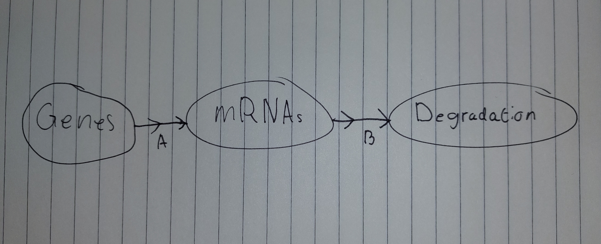

```{r setup, include=FALSE}
knitr::opts_chunk$set(echo = TRUE)
```
## Week 1 Opdracht

### 1.0

[1] Welke parameters moet je programmeren?

    R: Het nummer van transcripties
    r: De afname van de snelheid van de transcripties
    m: het nummer van nieuwe transcripties die worden geproduceerd per sec    
[2] Zoek bronnen op internet die uitleggen waar de formule dR/dt = -rR + m vandaan komt.

    https://arep.med.harvard.edu/pdf/Chen99.pdf
[3] Teken het biologisch model en leg de vertaling naar de formule uit.



    >Uitleg<
[4] Wat is de return waarde van de model functie in R? Waarom return je die en niet R zelf?

    Een List. Omdat je met een List van de waarden meer dingen kan doen. Dingen zoals meerdere libraries         gebruiken om nog aan de data te sleutelen. 

# 2.0 Opdracht
```{r}
library(deSolve)

steady_params <- c(m= 10, r = 0.1)
incr_params <- c(m= 12, r = 0.1)
decr_params <- c(m = 8, r = 0.1)

volume <- function(t, R, parms){
  with(as.list(c(parms)), {
    dR <- - r * R + m
    return(list(c(dR)))
    }
    )
}

state <- c(Volume = 100)
times <- seq(0, 100, by = 1)

steady <- ode(times = times, y = state, parms = steady_params, func = volume, method = "euler")
increasing <- ode(times = times, y = state, parms = incr_params, func = volume, method = "euler")
decreasing <- ode(times = times, y = state, parms = decr_params, func = volume, method = "euler")


plot(steady, col = "Red")
lines(increasing, col = "Green")
lines(decreasing, col = "Blue")
```